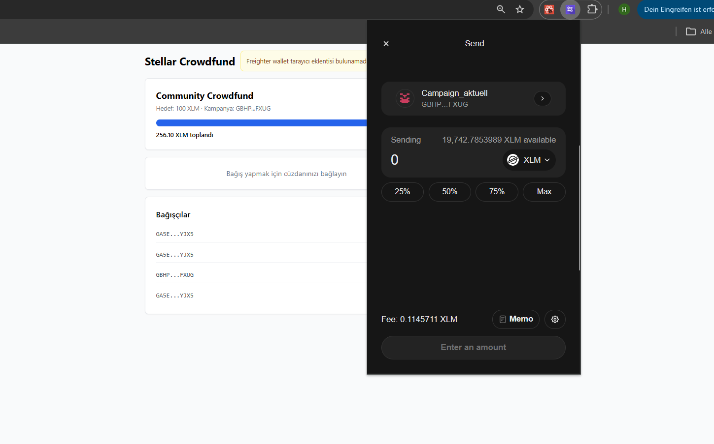
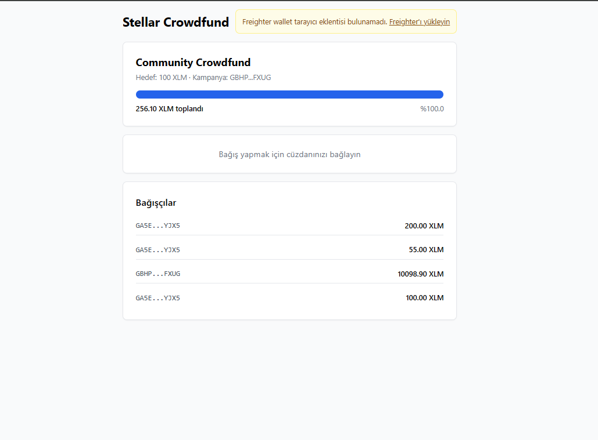

# Stellar Crowdfund

Stellar testnet üzerinde çalışan, Freighter cüzdanı ile bağlanıp tek bir kampanya adresine XLM bağışı yapmayı sağlayan bir frontend uygulamasıdır.

## Özellikler

- Freighter cüzdan bağlantısı (bağlan / çıkış yap)
- Bağlı cüzdanın XLM bakiyesini görüntüleme
- Kampanya ilerleme çubuğu (toplanan / hedef)
- XLM bağışı gönderme + opsiyonel mesaj (memo)
- Başarılı / başarısız işlem bildirimi
- Bağışçı listesi (Horizon API'den son 10 payment)
- 15 saniyede bir otomatik kampanya güncelleme

## Gereksinimler

- [Freighter](https://freighter.app) tarayıcı eklentisi
- Stellar testnet cüzdanı (Freighter üzerinden oluşturun)
- Test XLM'i ([Friendbot](https://friendbot.stellar.org) ile alabilirsiniz)

## Kurulum

```bash
git clone <repo-url>
cd stellar-crowdfund
npm install
npm run dev
```

Uygulama çalıştıktan sonra tarayıcıda http://localhost:5173 adresini açın.

## Yapılandırma

`src/config.js` dosyasını kendi kampanya adresinizle güncelleyin:

```js
export const CAMPAIGN_ADDRESS = 'GB...'; // Kendi testnet adresiniz
export const GOAL_XLM = 100000;
```

## Kullanım

1. Tarayıcıda http://localhost:5173 adresini açın
2. "Cüzdanı Bağla" butonuna tıklayın
3. Kampanya ilerleme çubuğunu görüntüleyin
4. Miktar girin, isteğe bağlı mesaj ekleyin
5. "Bağış Yap" butonuna tıklayın
6. İşlem sonucunu kullanıcıya gösterilen bildirimde görün

## Ekran Görüntüleri

Aşağıdaki görseller, uygulamanın temel kullanıcı akışını göstermektedir:

### 1) Cüzdan bağlı durumu



### 2) Bakiye görünen durum




## Tech Stack
- OpenCode for Vibe Coding
- Superpowers, An agentic skills
- React 18 + Vite
- Tailwind CSS
- @stellar/stellar-sdk v12
- Freighter Wallet API
- Stellar Testnet (Horizon)
